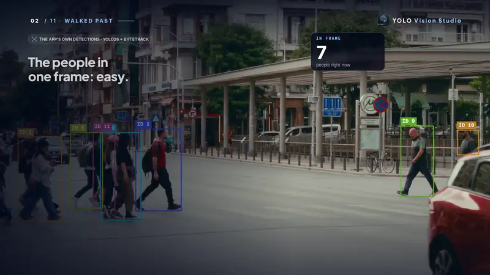
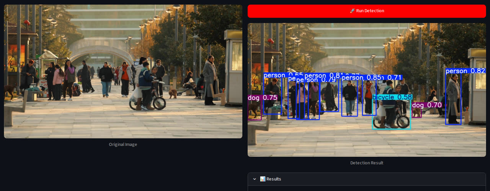
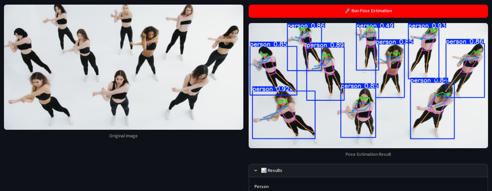
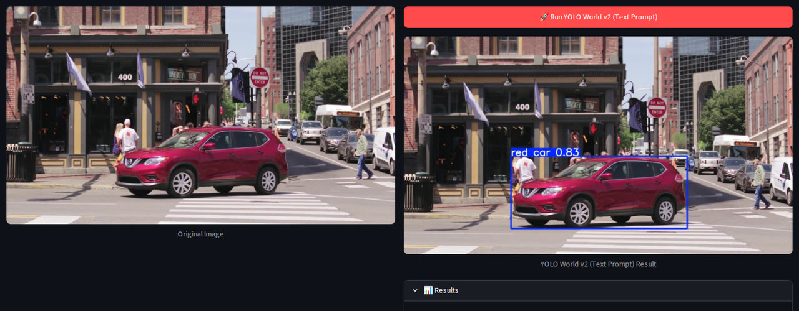
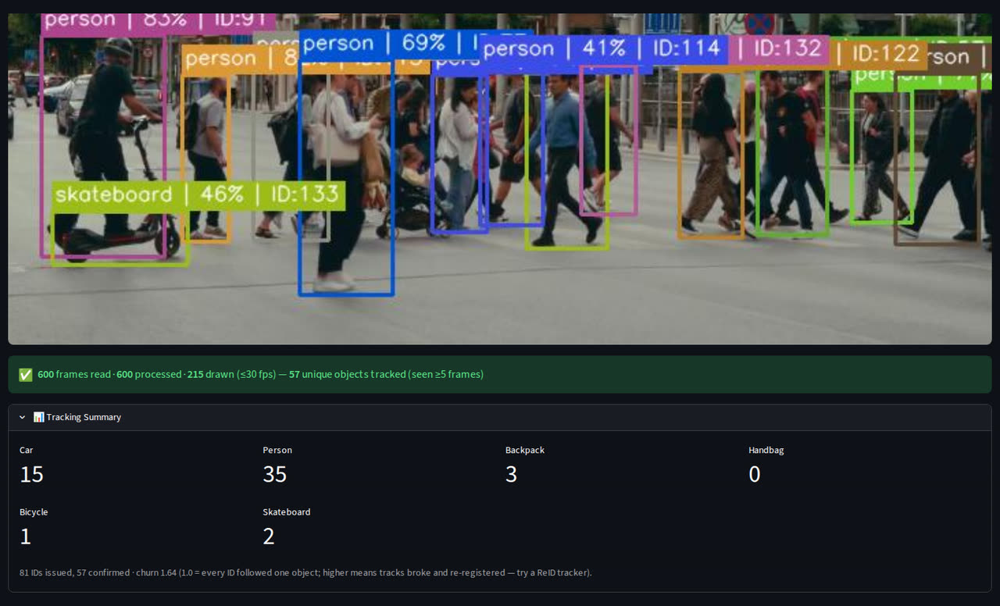
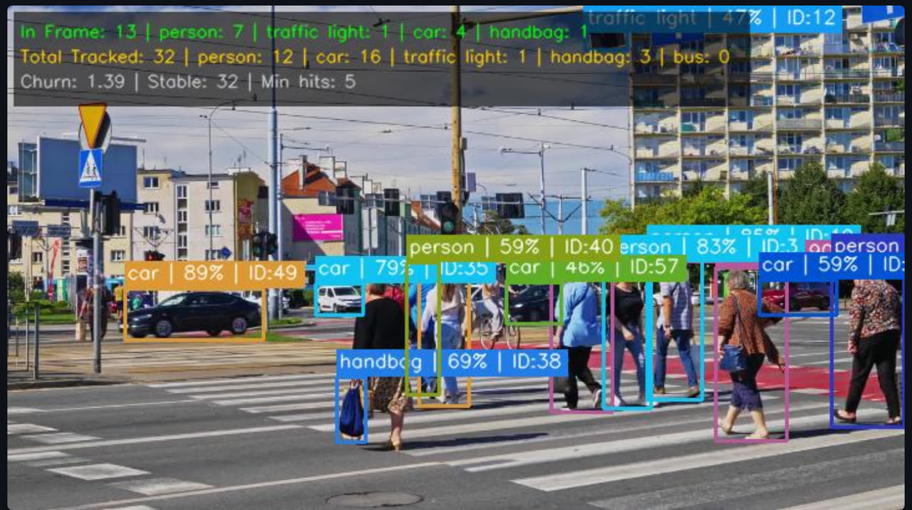
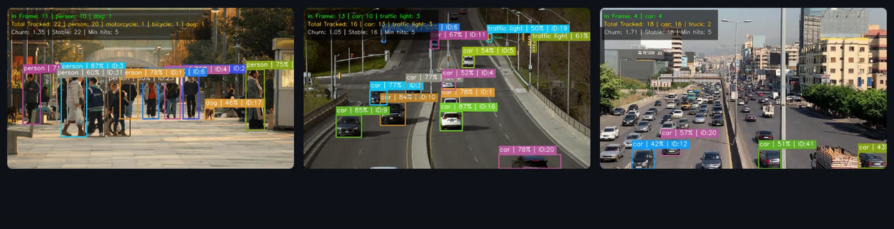

<div align="center">

# 🔬 YOLO Vision Studio

**Detect · Segment · Read poses · Find what you type · Track and count in video**<br>
A free, open-source Streamlit app built on Ultralytics YOLO26, YOLOE, YOLO World v2 and RT-DETR.

[](https://github.com/aparsoft/yolo-streamlit-detection-tracking/stargazers)
[](https://github.com/aparsoft/yolo-streamlit-detection-tracking/releases/latest)
[](https://python.org)
[](https://ultralytics.com)
[](LICENSE)

[Watch the film](https://github.com/aparsoft/yolo-streamlit-detection-tracking/releases/download/v2.1.0/yolo-vision-studio-film-16x9.mp4) · [45-second cut](https://github.com/aparsoft/yolo-streamlit-detection-tracking/releases/download/v2.1.0/yolo-vision-studio-45s-9x16.mp4) · [Quick start](#-quick-start) · [Report a bug](https://github.com/aparsoft/yolo-streamlit-detection-tracking/issues)



</div>

---

## Why this app

Point a camera at a street and ask how many people walked past. Counting the people **in one frame** is easy.
Knowing how many **different** people walked past is the hard part: people overlap, cross and walk out of view, and a
careless tracker counts the same person three times.

YOLO Vision Studio shows both numbers on every frame, and is honest about them:

- **In frame** (green): what the detector sees right now.
- **Walked past / tracked** (yellow): different objects so far. An object counts only after it has been tracked for
  **5 frames**, so a one-frame false detection never inflates the total.
- **Churn** (grey): IDs issued ÷ objects followed. 1.0 means every ID followed one object; higher means tracks broke and
  re-registered (try a ReID tracker).

## What it does

| | |
|:--|:--|
| <br>**Detect** 80 everyday object types (YOLO26 nano → xlarge, or RT-DETR) | <br>**Pose**: body keypoints and skeletons. Plus **segmentation** masks |
| <br>**Type what you're looking for** (YOLO World v2): `red car` finds only the red one | <br>**Honest counts**: IDs issued vs confirmed, per class, with churn |
| <br>**Four trackers** (ByteTrack, BoT-SORT, Deep OC-SORT, TrackTrack) and optional appearance ReID | <br>**Several videos side by side**, each with its own tracker |

- **Sources:** stored files, your **webcam** (in the browser), **RTSP** camera streams, **YouTube** URLs.
- **YOLOE:** type category names (`person, car, laptop`) and get boxes **and** masks.
- **Limit to classes** (cheaper and cleaner counts), **Skip frames** (1–8×), a **⏹ Stop** button, live metrics in the sidebar.
- **Appearance ReID** matches how objects look *within one video*, to keep an ID through a crossing. The app never knows who anyone is; there is no face recognition.

**YOLO World prompts:** one object with one attribute works best (`red car`, `dog`, `wooden chair`). Descriptions of
people (`person in black`) score low; if a prompt finds nothing, lower the confidence.

---

## 🚀 Quick start

**With [uv](https://docs.astral.sh/uv/) (recommended):** installs the exact versions in `uv.lock` on Linux, macOS and
Windows.

```bash
git clone https://github.com/aparsoft/yolo-streamlit-detection-tracking.git
cd yolo-streamlit-detection-tracking
uv sync                                     # creates .venv with the locked versions
uv run python scripts/get_sample_videos.py  # optional: the 8 other sample clips (~34 MB)
uv run streamlit run app.py                 # opens http://localhost:8501
```

**With pip:**

```bash
git clone https://github.com/aparsoft/yolo-streamlit-detection-tracking.git
cd yolo-streamlit-detection-tracking
python -m venv .venv
source .venv/bin/activate                   # Windows: .venv\Scripts\activate
pip install -r requirements.txt             # or requirements-lock.txt for the exact locked versions
python scripts/get_sample_videos.py         # optional
streamlit run app.py
```

- **Python 3.10+** (tested on 3.12). Runs on CPU; an NVIDIA GPU makes video much faster. On Linux, PyTorch from PyPI
  already includes CUDA; on Windows, install a CUDA build from [pytorch.org](https://pytorch.org/get-started/locally/) first.
- **Model weights download automatically** on first use (into `weights/`).
- `uv sync` also installs Jupyter support for the [playground notebook](docs/yolo26_playground.ipynb). RF-DETR
  experiments: `uv sync --group rfdetr`.

### Sample videos

One clip ships in git (`videos/pedestrians_summer_street.mp4`), so the app works straight after a clone. The other
eight live on the [sample-videos release](https://github.com/aparsoft/yolo-streamlit-detection-tracking/releases/tag/sample-videos)
to keep the repo small; `scripts/get_sample_videos.py` downloads them and checks each one against its SHA-256, so every
machine runs the same clips. They are [Pexels](https://www.pexels.com/license/) clips, chosen by running this app's own
detector and tracker over 731 candidates; creators are credited in [`videos/ATTRIBUTION.md`](videos/ATTRIBUTION.md).

Your own videos: drop `.mp4` / `.avi` / `.mkv` / `.mov` / `.webm` files into `videos/`. They appear in the picker on the next rerun.

---

## 📖 Using it

**Sidebar:** Inference mode (📷 image / 🎬 video) → Task → 🧠 Model (nano is fastest, xlarge most accurate) → Confidence.

**Images:** upload one, or press **Run** on the default image. Results show the annotated image, per-class counts and every detection's confidence.

**Video:**
1. Pick a source: **Stored Video**, **Webcam**, **RTSP Stream** (paste the camera URL) or **YouTube**.
2. Tracking is on by default. Choose a tracker; for BoT-SORT, Deep OC-SORT and TrackTrack you can switch on **Appearance ReID** and tune its gates.
3. Optional: **🎯 Limit to classes**, **⏩ Skip frames**. For YOLO World / YOLOE, type the prompts.
4. **🚀 Detect**. Counts appear on the frame and in the sidebar; **⏹ Stop** ends early; a Tracking Summary follows.

---

## ⚙️ Configuration

Everything lives in `config.py`:

```python
DEFAULT_CONFIDENCE  = 0.40        # sidebar default
MIN_TRACK_HITS      = 5           # frames before a track counts
VIDEO_DISPLAY_WIDTH = 720         # a ceiling: frames are never upscaled
VIDEO_DISPLAY_FPS   = 30.0        # frames painted per second (every frame is still inferred)
DEFAULT_VIDEO       = "pedestrians_summer_street"
DEFAULT_WORLD_CLASSES = "person, car, dog, cat, chair, table, laptop, phone"
```

**Your own model:** put the `.pt` file in `weights/` and add it to the task's catalog in `config.py`
(for example `DETECTION_MODELS["My model"] = "my_model.pt"`). It then appears in the 🧠 Model selector.

## 🗂️ Project structure

```
yolo-streamlit-detection-tracking/
├── app.py                 # page setup, sidebar, routing
├── config.py              # models, paths, defaults
├── model_loader.py        # cached + per-session models, device placement
├── image_service.py       # image tasks: upload → run → results
├── video_service.py       # sources, tracking, counting, overlay, live metrics
├── scripts/get_sample_videos.py
├── docs/                  # playground notebook, performance notes
├── assets/readme/         # README media
├── images/  videos/  weights/
├── pyproject.toml  uv.lock               # uv
└── requirements.txt  requirements-lock.txt  packages.txt   # pip, Streamlit Cloud
```

## ☁️ Deploy to Streamlit Cloud

Connect the repo at [share.streamlit.io](https://share.streamlit.io) with `app.py` as the main file; `requirements.txt`
and `packages.txt` handle the dependencies. Streamlit Cloud has no GPU, so video is slower there; the webcam works in the
browser through streamlit-webrtc.

---

## 🤝 Contributing

Issues and pull requests are welcome: fork, branch, commit, open a PR. Good first ideas:

- [ ] Export detections and tracks to CSV / JSON
- [ ] Region-of-interest (line or zone) counting
- [ ] An `imgsz` control in the sidebar (accuracy vs speed)
- [ ] A model comparison page
- [ ] A multi-camera RTSP dashboard

## 📄 License

The app's code is [Apache-2.0](LICENSE). The models come from [Ultralytics](https://github.com/ultralytics/ultralytics)
under **AGPL-3.0** (closed-source commercial use needs their Enterprise licence). The sample footage is from Pexels
creators ([credits](videos/ATTRIBUTION.md)).

## 🙏 Acknowledgements

- [Ultralytics](https://github.com/ultralytics/ultralytics) for YOLO26, YOLOE, YOLO World and RT-DETR
- [Streamlit](https://github.com/streamlit/streamlit) and [streamlit-webrtc](https://github.com/whitphx/streamlit-webrtc)
- The Pexels creators whose clips make the demos, and all 400+ stargazers ⭐

<div align="center">

Made by [Aparsoft](https://aparsoft.com/) · Need vision AI on your own cameras? **contact@aparsoft.com**

</div>
